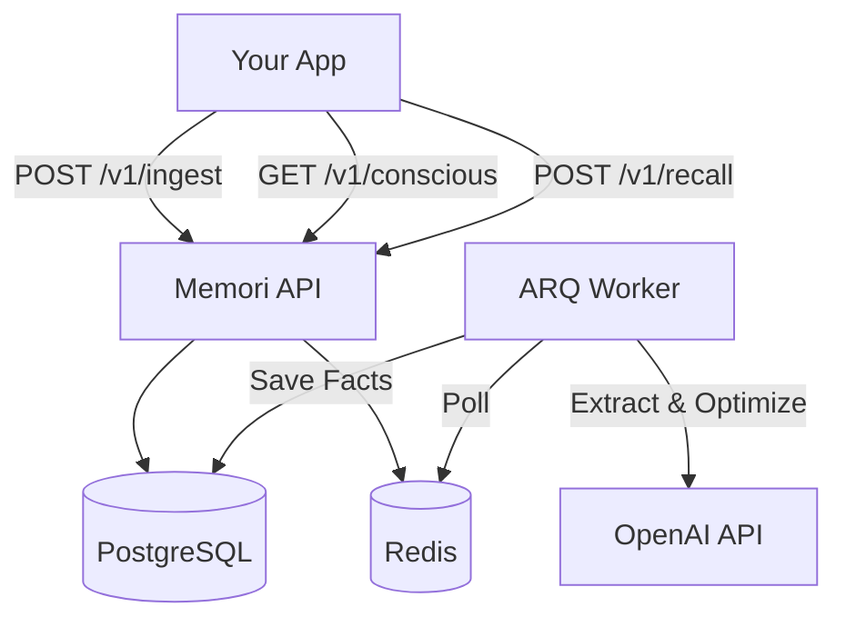

# "Mémoire" API 

**Mémoire** is a production-grade, service-oriented memory engine for AI agents. It provides persistent, long-term memory on top of PostgreSQL + pgvector, with a clean, language-agnostic HTTP API.

Designed as a "Sidecar Brain," it runs alongside your main application, handling memory ingestion, storage, optimization, and retrieval via a clean REST API.

---

## 🚀 Key Features

- **Sidecar Memory Service**: Runs as a standalone Docker service. Your app stays lightweight; Memori handles the heavy lifting.
- **SQL + Vectors**: PostgreSQL 15 + `pgvector` for portable, queryable, and semantically searchable memories.
- **Dual Memory System**:
  - **Conscious / Working Memory**: “Essential” facts (identity, long‑term prefs) returned by `/v1/conscious`.
  - **Long‑Term Recall**: Query‑aware retrieval via `/v1/recall`.
- **Intelligent Extraction Pipeline**:
  - Uses pluggable LLM providers (OpenAI, Anthropic, Gemini, OpenRouter) for structured fact extraction.
  - Fuzzy deduplication and **slot‑based supersession** (e.g., “moved from SF to Dallas” supersedes the old location).
  - Lifecycle metadata: `superseded_by`, `expires_at`, `last_refreshed_at`, plus periodic decay of stale facts.
- **Recall That Respects Context**:
  - Hybrid **vector + fuzzy** retrieval with filters (`categories`, `max_age_days`, `current_view_only`).
  - Conflict‑aware “current view” that hides superseded facts.
- **Secure API Access**:
  - Per‑user API keys via `/v1/users`, sent as `X-API-Key`.
  - Per‑key rate limiting built in.
- **Observability**:
  - Prometheus metrics at `/metrics` (request counts/latency, recall latency).
  - Structured validation via Pydantic everywhere.

---

## 🏗️ Architecture

The system is built on a robust, async-first stack:

- **API Layer**: FastAPI (Python 3.11+)
- **Database**: PostgreSQL 15 + `pgvector`
- **Queue/Cache**: Redis
- **Worker**: ARQ (Async Task Queue)
- **ORM**: SQLAlchemy 2.0 (Async)



---

## ⚡ Quick Start

### Prerequisites
- Docker & Docker Compose
- A Postgres + Redis instance (or use the included `docker-compose.yml`)
- An LLM provider key (OpenAI, OpenRouter, Anthropic, or Gemini)

### 1. Setup
```bash
# Clone the repository
git clone https://github.com/rajat1299/ai-memory-engine.git
cd ai-memory-engine

# Configure environment
cp .env.example .env
```

Edit `.env` and set at least:

```env
DATABASE_URL=postgresql+asyncpg://memori:memori@db:5432/memori
REDIS_URL=redis://redis:6379

LLM_PROVIDER=openrouter        # or: openai|anthropic|gemini
OPENROUTER_API_KEY=sk-or-...   # or the corresponding provider key
OPENROUTER_MODEL=openai/gpt-4o-mini
OPENROUTER_EMBEDDING_MODEL=openai/text-embedding-3-small
DEBUG=False
```

### 2. Run (Docker)

```bash
# Start Postgres + Redis
docker-compose up -d db redis

# Apply migrations
docker-compose run api alembic upgrade head

# Start API + worker
docker-compose up api worker
```

The API will be available at `http://localhost:8000`.

---

## 🔌 API Usage

### 0. Create a Memori user + API key

```bash
curl -X POST http://localhost:8000/v1/users \
  -H "Content-Type: application/json" \
  -d '{}'
```

**Response:**
```json
{
  "id": "435a51ce-786f-4fe2-8b20-f0880f86d965",
  "api_key": "memori_... (shown once)"
}
```

Store `id` and `api_key` on the client side. All subsequent calls must send:

```http
X-API-Key: memori_...
```

### 1. Create a session

```bash
curl -X POST http://localhost:8000/v1/sessions \
  -H "Content-Type: application/json" \
  -H "X-API-Key: memori_..." \
  -d '{
    "user_id": "435a51ce-786f-4fe2-8b20-f0880f86d965"
  }'
```

**Response:**
```json
{
  "id": "63154bff-f4b4-419c-bba4-372d6a89c3dc",
  "user_id": "435a51ce-786f-4fe2-8b20-f0880f86d965",
  "created_at": "2025-11-25T19:04:42.438656Z"
}
```

### 2. Ingest chat (write)

```bash
curl -X POST http://localhost:8000/v1/ingest \
  -H "Content-Type: application/json" \
  -H "X-API-Key: memori_..." \
  -d '{
    "user_id": "435a51ce-786f-4fe2-8b20-f0880f86d965",
    "session_id": "63154bff-f4b4-419c-bba4-372d6a89c3dc",
    "role": "user",
    "content": "I live in Austin now and love hiking."
  }'
```

This:
- Writes a chat log row.
- Enqueues `extract_facts_task` in Redis.
- Worker extracts facts, dedups, supersedes old BIOGRAPHICAL facts (e.g., old location), and stores embeddings.

### 3. Recall (read)

Retrieve relevant facts for a query:

```bash
curl -X POST http://localhost:8000/v1/recall \
  -H "Content-Type: application/json" \
  -H "X-API-Key: memori_..." \
  -d '{
    "user_id": "435a51ce-786f-4fe2-8b20-f0880f86d965",
    "query": "where do I live now?",
    "limit": 5,
    "current_view_only": true,
    "max_age_days": 90,
    "categories": ["biographical"]
  }'
```

**Response (example):**
```json
{
  "relevant_facts": [
    {
      "category": "biographical",
      "content": "Lives in Austin",
      "confidence": 0.96
    }
  ]
}
```

### 4. Conscious load (essential facts)

At session start, load “always‑on” facts:

```bash
curl -X GET http://localhost:8000/v1/conscious/435a51ce-786f-4fe2-8b20-f0880f86d965 \
  -H "X-API-Key: memori_..."
```

This returns the essential subset (`is_essential = true`) chosen by the optimization job.

---

## 🧠 Background Intelligence

Memori runs two types of background tasks:

1.  **Immediate Extraction**: Triggered on `/ingest`. Extracts atomic facts from the last few messages.
2.  **Periodic Optimization**: Runs every 6 hours. Analyzes the user's memory bank to identify and promote "Essential" facts (setting `is_essential=true`), which are then returned by the `/conscious` endpoint.
3.  **Decay**: Periodically reduces confidence for stale facts, based on `last_refreshed_at`, so long‑unused facts fade over time.

---

## 🛠️ Development

```bash
# Run tests
docker-compose run api pytest

# Lint code
docker-compose run api ruff check .

# Check coverage
docker-compose run api coverage run -m pytest
```

## 📄 License

MIT
