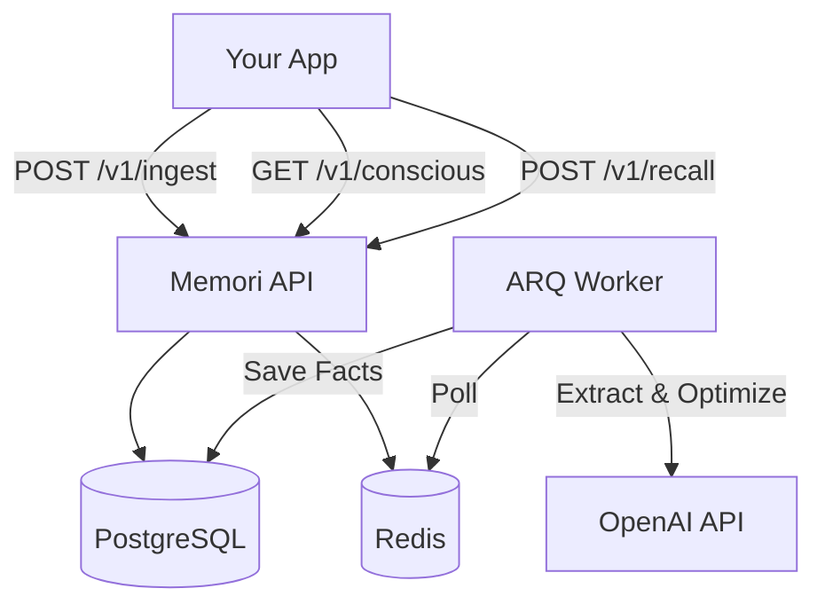

# Memori API - The Sidecar Brain

**Memori** is a production-grade, service-oriented memory engine for AI agents. It provides persistent, long-term memory without the complexity of vector databases or the fragility of in-process libraries.

Designed as a "Sidecar Brain," it runs alongside your main application, handling memory ingestion, storage, optimization, and retrieval via a clean REST API.

---

## 🚀 Key Features

- **Service-Oriented Architecture**: Runs as a standalone Docker service. Your app stays lightweight; Memori handles the heavy lifting.
- **SQL-Native Storage**: Uses standard PostgreSQL (with `pgvector` support) for portable, queryable data.
- **Dual Memory System**:
  - **Working Memory (Conscious)**: High-priority facts (User Identity, Preferences) loaded at startup.
  - **Long-Term Memory (Recall)**: Dynamic retrieval based on context.
- **Intelligent Extraction**:
  - Uses OpenAI + `instructor` for structured, type-safe fact extraction.
  - **Automatic Deduplication** prevents memory bloat.
  - **Periodic Optimization**: Background agents groom and promote essential memories.
- **"Junior-Proof" Design**:
  - Strict Pydantic schemas for all inputs/outputs.
  - No business logic in routes.
  - Impossible to corrupt memory state via API.

---

## 🏗️ Architecture

The system is built on a robust, async-first stack:

- **API Layer**: FastAPI (Python 3.11+)
- **Database**: PostgreSQL 15 + `pgvector`
- **Queue/Cache**: Redis
- **Worker**: ARQ (Async Task Queue)
- **ORM**: SQLAlchemy 2.0 (Async)



---

## ⚡ Quick Start

### Prerequisites
- Docker & Docker Compose
- OpenAI API Key

### 1. Setup
```bash
# Clone the repository
git clone https://github.com/rajat1299/ai-memory-engine.git
cd ai-memory-engine

# Configure environment
cp .env.example .env
# Edit .env and add your OPENAI_API_KEY
```

### 2. Run
```bash
# Start all services
docker-compose up --build -d

# Initialize database tables
docker-compose run api python init_db.py
```

The API will be available at `http://localhost:8000`.

---

## 🔌 API Usage

### 1. Start a Session (Conscious Load)
At the start of a user session, retrieve their "Essential Memories" (Identity, Preferences) to inject into your system prompt.

```bash
curl http://localhost:8000/v1/conscious/{user_id}
```

**Response:**
```json
{
  "relevant_facts": [
    {
      "category": "user_preference",
      "content": "Prefers concise Python code",
      "confidence": 1.0
    }
  ]
}
```

### 2. Ingest Chat (Write)
Send chat messages to Memori. It will save the log and trigger a background extraction job.

```bash
curl -X POST http://localhost:8000/v1/ingest \
  -H "Content-Type: application/json" \
  -d '{
    "user_id": "550e8400-e29b-41d4-a716-446655440000",
    "session_id": "session-uuid",
    "role": "user",
    "content": "I live in San Francisco and love hiking."
  }'
```

### 3. Recall (Read)
Retrieve relevant facts based on a query or context.

```bash
curl -X POST http://localhost:8000/v1/recall \
  -H "Content-Type: application/json" \
  -d '{
    "user_id": "550e8400-e29b-41d4-a716-446655440000",
    "query": "hobbies",
    "limit": 5
  }'
```

---

## 🧠 Background Intelligence

Memori runs two types of background tasks:

1.  **Immediate Extraction**: Triggered on `/ingest`. Extracts atomic facts from the last few messages.
2.  **Periodic Optimization**: Runs every 6 hours. Analyzes the user's memory bank to identify and promote "Essential" facts (setting `is_essential=True`), which are then returned by the `/conscious` endpoint.

---

## 🛠️ Development

```bash
# Run tests
docker-compose run api pytest

# Lint code
docker-compose run api ruff check .

# Check coverage
docker-compose run api coverage run -m pytest
```

## 📄 License

MIT
