# Mémoire

**Mémoire** is a production-grade, service-oriented memory engine for AI agents. It provides persistent, long-term memory on top of PostgreSQL + pgvector, accessible via a high-performance Python SDK or a clean, language-agnostic HTTP API.

Designed as a "Sidecar Brain," it runs alongside your main application, handling memory ingestion, storage, optimization, and retrieval. It allows you to build "Stateful LLMs" that remember user details, preferences, and past context across sessions.

-----

## 🚀 Key Features

### 🧠 The Intelligence Engine

  - **SQL + Vectors**: PostgreSQL 15 + `pgvector` for portable, queryable, and semantically searchable memories.

  - **Dual Memory System**:

      - **Conscious / Working Memory**: "Essential" facts (identity, long‑term prefs) available immediately at session start.

      - **Long‑Term Recall**: Query‑aware retrieval based on semantic relevance.

  - **Intelligent Extraction Pipeline**:

      - Uses pluggable LLM providers (OpenAI, Anthropic, Gemini, OpenRouter) for structured fact extraction.

      - **Slot‑Based Supersession**: Intelligent updates where new facts override old ones (e.g., "moved to Dallas" supersedes "lives in SF").

      - **Lifecycle Management**: Tracks `superseded_by`, `last_refreshed_at`, and applies periodic decay to stale facts.

### 🔌 Integration & SDK

  - **Sidecar Memory Service**: Runs as a standalone Docker service. Your app stays lightweight; Mémoire handles the heavy lifting.

  - **Python SDK**: A "Fail-Open" wrapper for your LLM client. If the memory backend is down, your app continues functioning (just without memory).

  - **Streaming Support**: Fully compatible with streaming LLM responses.

  - **Observability**: Prometheus metrics (request counts, latency) and structured Pydantic validation.

  - **Secure Access**: Per-user API keys and built-in rate limiting.

-----

## 🏗️ Architecture

The system is built on a robust, async-first stack:

  - **API Layer**: FastAPI (Python 3.11+)

  - **Database**: PostgreSQL 15 + `pgvector`

  - **Queue/Cache**: Redis

  - **Worker**: ARQ (Async Task Queue)

  - **SDK**: Python client wrapping standard LLM libraries

```mermaid
graph TD
    Client[Your App / SDK] -->|POST /v1/ingest| API[Mémoire API]
    Client -->|GET /v1/conscious| API
    Client -->|POST /v1/recall| API
    
    API --> DB[(PostgreSQL)]
    API --> Redis[(Redis)]
    
    Worker[ARQ Worker] -->|Poll| Redis
    Worker -->|Extract & Optimize| OpenAI[LLM Provider]
    Worker -->|Save Facts| DB
```

<!-- end list -->



-----

## ⚡ Quick Start

### Prerequisites

  - Docker & Docker Compose

  - An LLM provider key (OpenAI, OpenRouter, Anthropic, or Gemini)

### 1\. Backend Setup

```bash
# Clone the repository
git clone https://github.com/rajat1299/ai-memory-engine.git
cd ai-memory-engine

# Configure environment
cp .env.example .env
```

Edit `.env` and set your LLM credentials:

```env
DATABASE_URL=postgresql+asyncpg://memori:memori@db:5432/memori
REDIS_URL=redis://redis:6379

LLM_PROVIDER=openrouter       # or: openai|anthropic|gemini
OPENROUTER_API_KEY=sk-or-...   
```

### 2\. Run Services

```bash
# Start Postgres + Redis
docker-compose up -d db redis

# Apply migrations
docker-compose run api alembic upgrade head

# Start API + worker
docker-compose up api worker
```

The API is now active at `http://localhost:8000`.

-----

## 💻 Usage: Python SDK (Recommended)

The easiest way to integrate Mémoire is via the Python SDK, which wraps your existing LLM client to automate memory injection and extraction.

### 1\. Install

```bash
pip install -e ".[openai]"
```

### 2\. Auto-Memory Integration

```python
from memoire import Memoire
import openai

# Initialize the SDK with your Mémoire API Key
memoire = Memoire(api_key="memori_...")

# Wrap your OpenAI client
client = memoire.wrap(openai.OpenAI())

# 1. First interaction: Fact is ingested automatically
response = client.chat.completions.create(
    model="gpt-4o",
    user="user-123", # Required for memory tracking
    messages=[{"role": "user", "content": "I live in Austin, Texas now."}]
)

# ... Time passes ...

# 2. Second interaction: Memory is automatically recalled and injected
response = client.chat.completions.create(
    model="gpt-4o", 
    user="user-123",
    messages=[{"role": "user", "content": "Where do I live?"}]
)

# Output: "You live in Austin, Texas."
```

-----

## 🔌 Usage: REST API

If you are not using Python, or need fine-grained control, use the HTTP API directly.

### 1\. Create User & Key

```bash
curl -X POST http://localhost:8000/v1/users -d '{}'
# Returns: {"id": "...", "api_key": "memori_..."}
```

### 2\. Create Session

```bash
curl -X POST http://localhost:8000/v1/sessions \
  -H "X-API-Key: memori_..." \
  -d '{ "user_id": "<USER_ID>" }'
```

### 3\. Ingest Chat (Write)

Triggers the extraction pipeline to parse facts from the conversation.

```bash
curl -X POST http://localhost:8000/v1/ingest \
  -H "X-API-Key: memori_..." \
  -d '{
    "user_id": "<USER_ID>",
    "session_id": "<SESSION_ID>",
    "role": "user",
    "content": "I live in Austin now and love hiking."
  }'
```

### 4\. Recall (Read)

Retrieve relevant facts using hybrid vector + fuzzy search.

```bash
curl -X POST http://localhost:8000/v1/recall \
  -H "X-API-Key: memori_..." \
  -d '{
    "user_id": "<USER_ID>",
    "query": "where do I live?",
    "current_view_only": true
  }'
```

-----

## 🧠 Background Intelligence

Mémoire runs asynchronous tasks to ensure memory remains relevant and clean:

1.  **Immediate Extraction**: Triggered on `/ingest`. Extracts atomic facts from the last few messages, deduplicates them, and stores embeddings.

2.  **Periodic Optimization**: Runs every 6 hours. Analyzes the user's memory bank to identify "Essential" facts (setting `is_essential=true`), which are promoted to the `/conscious` payload for fast loading.

3.  **Decay**: Periodically reduces confidence scores for stale facts based on `last_refreshed_at`, allowing unused information to fade naturally.

-----

## 🛠️ Development

```bash
# Run tests
docker-compose run api pytest

# Lint code
docker-compose run api ruff check .
```

## 📄 License

MIT
